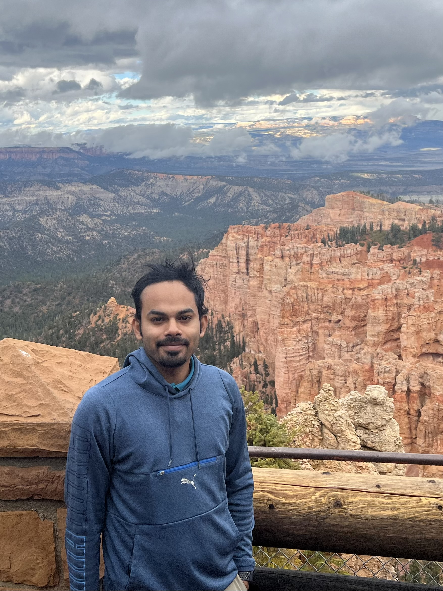

  
  

    <h1 style="margin-bottom:0;">Debdut Mandal</h1>
    
<strong>Electrical Engineering researcher</strong> focused on optimization, inverse problems, and probabilistic modeling for multidimensional MRI and survival analysis.

    

      Optimization (ADMM / LADMM)
      Multidimensional MRI
      Survival Modeling
      Uncertainty & CRLB
    

    
<a href="https://drsuite.org">DRSuite</a> · <a href="https://github.com/debdutblank">GitHub</a> · <a href="https://scholar.google.com/citations?user=CDlY6_EAAAAJ&hl=en">Google Scholar</a> · <a href="mailto:debdutmandal123@gmail.com">Email</a>

  

## Snapshot

  

    <h4>Education</h4>
    
M.S. Electrical Engineering, USC (Dec 2025) · IIT Kharagpur Integrated B.Tech + M.Tech

  

  

    <h4>Current Focus</h4>
    
Efficient solvers, low-rank regularization, and uncertainty-aware methods for quantitative imaging and prognosis modeling.

  

  

    <h4>Software & Methods</h4>
    
Python, MATLAB, reproducible pipelines, benchmarking, signal/image processing, estimation and inverse problems.

  

## Selected Impact

- **Lead developer, DRSuite:** built an open-source toolkit spanning phantom generation, spectral estimation (NNLS/ADMM/LADMM), visualization, and CRLB-based acquisition analysis.
- **Linearized ADMM framework:** achieved reported **3–50× speedups** and **2–15× memory savings** in spatial–spectral map recovery.
- **Survival pipeline (QRT Challenge ’26):** engineered multimodal leukemia risk features and tuned censoring-aware models (Cox / XGBoost-Cox) against IPCW C-index at \(\tau = 7\) years.
- **Axon radii estimation from clinical dMRI:** developed ADMM-based modeling validated on synthetic and in-vivo data against stronger-reference protocols.
